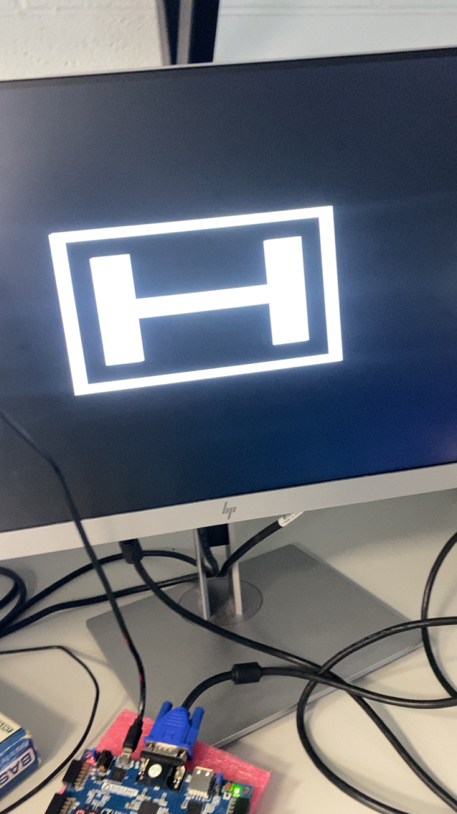
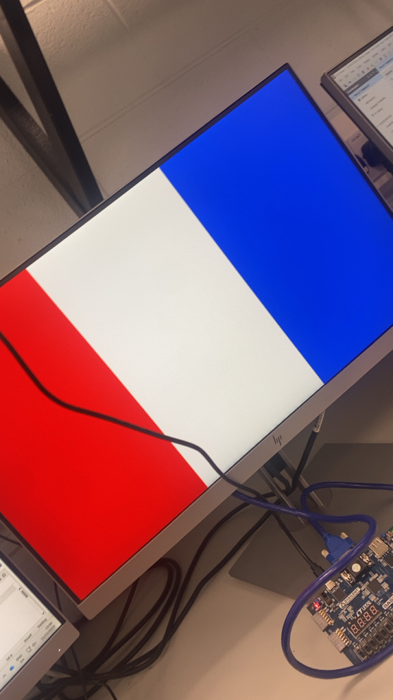
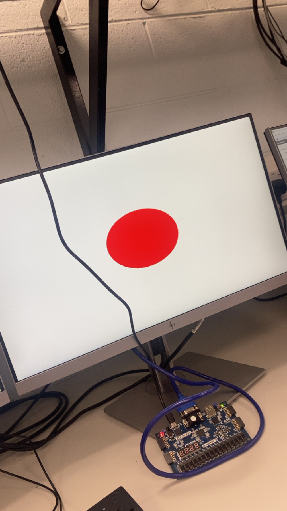
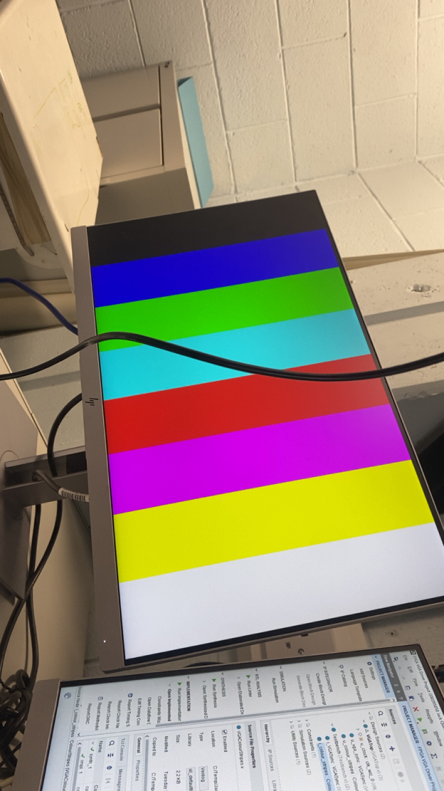

this is my soc fgpa-vga-verilog project in this project i have edited and modified given files to create a image such as flags or logos . 

## **Template VGA Design**
### **Project Set-Up**
screenshot of summary

### **Template Code**
we were given 2 files to work off of one was colourstripes and the other was colourcycle.colourstripes was a setup of code that had rows set up and in each section of pixels there was a colour stripe going across the screen.for the coulour cycle was code that would alternate through colours on the screen for eg (screen would go blue then ren then green ...)this was all sent through using fgpa ports and the fgpa board.  screenshot of template code 
### **Simulation**
Simulation is used to verify that HSYNC, VSYNC, and RGB outputs behave correctly before programming the FPGA. In Vivado’s simulator, you can check that the sync pulses align with the expected timing and that pixel data changes only during the active display window.    screenshot of simulation
### **Synthesis**
Synthesis converts the Verilog into logic gates mapped onto the FPGA. Implementation then places and routes those gates into the Basys3’s fabric.    screen shot of synthesis
### **Demonstration**
When programmed, the Basys3 outputs the VGA test pattern to a monitor, confirming the driver works.

## **My VGA Design Edit**
my vga design idea was originally going to be a honda logo with a honda civic pixel art in the background due to the time constraints we had with only being able to work on it in the labs made this a diffucult task as it wasnt complex to make it would just be time consuming so in the end of the project all i managed to make was just the logo 
### **Code Adaptation**
so what ii did to displayb a image i change the colourstripes file as it was the static file i replace rows with smaller lines using row and col to make a h logo wwith also a box around it for a border then i had the background made black by giving all the values 0 bits and made the logo white by giving all the bits 1
### **Simulation**
i ran the code that was altered for the honda logo in vivado simulator they where then confirmed that the timing was correct and rgb outputs showed expected transistors where the logo pixels where defined one important detail was to ensure that the regions were correct where i wanted black the bits would be zero and where i wanted white the bits would be 1.
### **Synthesis**
The synthesis and implementation reports for the custom logo design were very similar to those of the template .timing closure was still achieved without issues. This shows that even with custom pixel patterns, the design remains lightweight and efficient on the Basys3 FPGA.
### **Demonstration**
When programmed onto the Basys3 board, the VGA monitor displayed the Honda logo in white against a black background, inside a border. This confirmed that the adapted design worked correctly in hardware.
also befor my main logo was created i tested out flags to fimilarize myself with the code

## **More Markdown Basics**
This is a paragraph. Add an empty line to start a new paragraph.

Font can be emphasised as *Italic* or **Bold**.

Code can be highlighted by using `backticks`.
Hyperlinks look like this: [GitHub Help](https://help.github.com/).

A bullet list can be rendered as follows:
- vectors
- algorithms
- iterators

Images can be added by uploading them to the repository in a /docs/assets/images folder, and then rendering using HTML via githubusercontent.com as shown in the example below.

